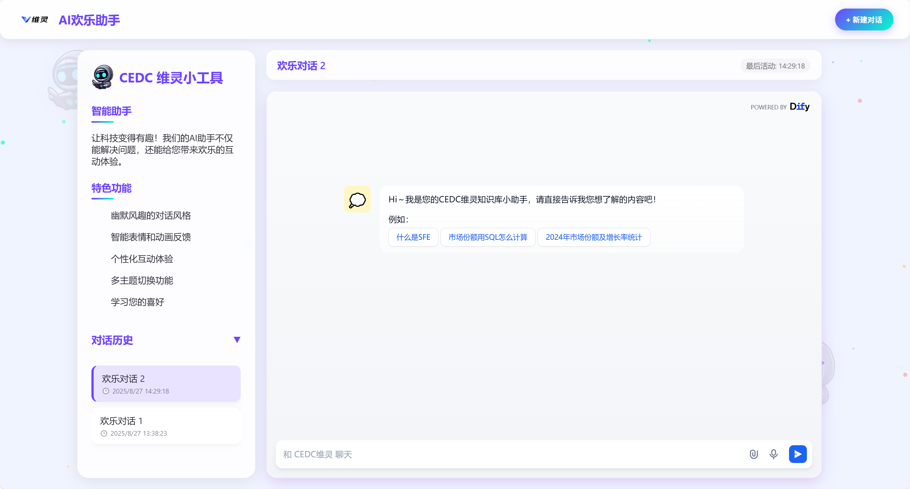
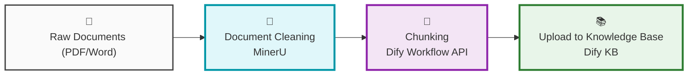

<div align="center">
  
</div>

<div align="center">
  A powerful AI knowledge base system based on Dify.
  <br>
  This project integrates document cleaning, intelligent chunking, and a web frontend to enable real-time updates and correction management for domain knowledge bases in any field.
</div>

<p align="center">
  <br>
  <a href="https://www.python.org/">
    
  </a>

  <a href="https://opensource.org/licenses/MIT">
    
  </a>

  <a href="https://dify.ai/">
    
  </a>

  <a href="https://mineru.net/">
    
  </a>

  <a href="https://www.siliconflow.cn/">
    
  </a>
</p>

<p align="center">
  <strong>English</strong> | <a href="README_CN.md">中文</a>
  <br>
</p>


## Quick Preview

<div align="center">
  
</div>

---

## Table of Contents

- [Quick Preview](#quick-preview)
- [Table of Contents](#table-of-contents)
- [Features](#features)
  - [Todo](#todo)
- [Architecture](#architecture)
  - [Data Processing Flow](#data-processing-flow)
  - [Frontend Interaction](#frontend-interaction)
- [Installation](#installation)
- [Usage](#usage)
  - [Document Import](#document-import)
  - [Knowledge Base Sync](#knowledge-base-sync)
  - [Frontend](#frontend)
- [Project Structure](#project-structure)
- [Contributing](#contributing)
- [License](#license)

---

## Features
- **📄 Document Cleaning with MinerU**: Cleans raw documents to prepare for downstream intelligent processing.
- **🔁 Intelligent Chunking via Dify Workflow API**: Uses Dify's workflow interface to split documents into parent-child structured chunks.
- **📚 Auto-sync to Knowledge Base**: Automatically syncs cleaned and chunked content to the specified Dify knowledge base.
- **🌐 Web Frontend**: An intuitive web interface where users can:
  - Use AI Chat to query knowledge base content
  - Correct AI-generated wrong answers
  - Submit new knowledge entries directly

---

### Todo

- ✅ **Document Preprocessing (MinerU Integration)**
  - Completed initial cleaning of raw documents with MinerU, including removing irrelevant content and normalizing image formats.
  - Outputs structured cleaned text for subsequent processing.

- ✅ **Invoke Dify API for Parent-Child Paragraph Chunking (Dify API - Chunking Workflow)**
  - Automatically calls Dify's Workflow API via Python.
  - Implements parent-child hierarchical chunking while preserving logical context for downstream knowledge base syncing.

- ✅ **Knowledge Base Auto Sync**
  - Automatically submits processed chunks to the corresponding knowledge base (matching by document or category).
  - Data can be uploaded via scripts and auto-classified; incremental update logic is under development.
  - Plans include retry on errors, conflict detection, and upload success logging.

- ✅ **Multi-document Processing and Batch Import**
  - Supports uploading multiple documents for automated cleaning, chunking, and uploading.
  - Supports category-based management of knowledge content.

- ⬜️ **Frontend Web Development**
  - Initial frontend version implemented, including:
    - Knowledge base search and display
  - To be implemented:
    - User feedback entry (correction suggestions)
    - Form for users to add knowledge base content

- ⬜️ **User Feedback Processing Mechanism**
  - Supports users to correct and annotate existing knowledge content.
  - Backend plans to auto-categorize feedback and provide review interfaces for knowledge updates.

- ⬜️ **New Content Review and Sync Mechanism**
  - Newly added knowledge will go through manual/semi-automatic review.
  - After approval, it will be automatically synced to the Dify knowledge base with author records and change logs.


---

## Architecture

### Data Processing Flow


```mermaid
flowchart LR

A["📄<br/>Raw Documents (PDF/Word)"] --> B["🧼<br/>Document Cleaning<br/>MinerU"]

B --> C["🧩<br/>Chunking<br/>Dify Workflow API"]

C --> D["📚<br/>Upload to Knowledge Base<br/>Dify KB"]

style A fill:#fafafa,stroke:#424242,stroke-width:2px
style B fill:#e0f7fa,stroke:#0097a7,stroke-width:3px
style C fill:#f3e5f5,stroke:#8e24aa,stroke-width:3px
style D fill:#e8f5e9,stroke:#2e7d32,stroke-width:3px
```

### Frontend Interaction

- Users can query knowledge content
- If an answer is incorrect, they can correct it and submit suggestions
- Users can add new entries with structured input
- All actions are traceable and feed back to knowledge base maintainers

---

## Installation (content to be refined)

### Clone the repository

```bash
git clone https://github.com/Untitled1988/Dify.git
cd Dify
```

### Install dependencies (virtual environment recommended)

```bash
python -m venv venv
source venv/bin/activate  # On Windows use venv\Scripts\activate
pip install -r requirements.txt
```

---

## Usage (content to be refined)

### Document Import

Use `doc_preprocess.py` to perform document cleaning and paragraph extraction:

```bash
python doc_preprocess.py --input data/sample.pdf --output out/cleaned.json
```


### Knowledge Base Sync

Use `upload_to_dify_datasets.py` to upload `.txt`/`.md` files produced by `dify_doc_processor.py` to the corresponding Dify datasets (knowledge bases) using parent-child chunking. Files are routed by the filename prefix before the first underscore `_`.

- Routing rules (prefix → dataset name)
  - `Other_*` → `Other`
  - `业务知识_*` → `业务知识`
  - `运维手册_*` → `运维手册/SOP/KBA`
  - `SOP_*`, `KBA_*` → `运维手册/SOP/KBA`
  - Files without an underscore are skipped

- Default segmentation config (overridable)
  - Parent separator: `##`
  - Child separator: `\n`
  - Parent max length: 4000
  - Child max length: 4000

- API
  - Uses Dataset API Key (pass via `--dataset-token` or environment variable `DIFY_DATASET_API_KEY`)
  - API Base is read from `difyConfig.txt` `DIFY.API_BASE_URL` if present, and can be overridden via `--api-base`

Examples:

```bash
# Upload all processed results (.txt/.md) in a directory
python upload_to_dify_datasets.py --input D:/path/to/processed_dir

# Upload a single file (example: business knowledge prefix)
python upload_to_dify_datasets.py --input "D:/path/业务知识_销售指标.txt"

# Override segmentation / API base / token
python upload_to_dify_datasets.py \
  --input D:/path/to/dir \
  --api-base http://your-dify-host/v1 \
  --dataset-token your_dataset_token \
  --parent-sep "##" --child-sep "\n" --parent-max 1024 --child-max 512
```

Note: Name processed files as `prefix_title.txt`, e.g., `业务知识_SFE-目标医院的确定和选择.txt`. Files without an underscore prefix will not be uploaded.

### Frontend

Open the browser at [https://vling.刘竹.cn/](https://vling.刘竹.cn/) to get started.


## Project Structure

```
Dify/
├── dify_doc_processor.py       # Dify document processor (cleaning & chunking)
├── difyConfig.txt              # Dify API and parameter config
├── index.html                  # Web frontend homepage
├── LICENSE                     # Project license
├── PyCharmMiscProject.iml      # PyCharm project config
├── README_CN.md                # Chinese documentation
├── README.md                   # English documentation
├── requirements.txt            # Python dependencies
├── tool_dify.py                # Main entry point, integrates all modules
├── tool_dify.spec              # PyInstaller build config
├── upload_to_dify_datasets.py  # Batch upload processed docs to Dify KB
├── app/                        # Mini program/frontend directory
│   ├── app.json                # Mini program global config
│   ├── project.config.json     # Mini program project config
│   ├── sitemap.json            # Mini program sitemap
│   ├── assets/                 # Frontend assets (images, etc.)
│   │   ├── demo.png            # Demo image
│   │   ├── logo.png            # Logo image
│   │   └── robot.jpg           # Robot image
│   └── pages/                  # Mini program pages
│       └── index/              # Homepage
│           ├── index.js        # Homepage logic
│           ├── index.json      # Homepage config
│           ├── index.wxml      # Homepage structure
│           └── index.wxss      # Homepage style
├── assets/                     # Common image assets
│   ├── demo.png                # Demo image
│   ├── logo.png                # Logo image
│   └── robot.jpg               # Robot image
└── build/                      # Build output
  └── tool_dify/              # PyInstaller build files
    ├── Analysis-00.toc     # Build analysis
    ├── base_library.zip    # Python base library
    ├── EXE-00.toc          # Executable analysis
    ├── PKG-00.toc          # Package analysis
    ├── PYZ-00.pyz          # Pyz package
    ├── PYZ-00.toc          # Pyz analysis
    ├── tool_dify.pkg       # Main program package
    ├── warn-tool_dify.txt  # Build warnings
    └── xref-tool_dify.html # Cross-reference analysis
```

## Contributing

Contributions are welcome! If you have new features or improvement suggestions, feel free to open an issue or a pull request.

1. Fork this repository
2. Create your feature branch (`git checkout -b feature/your-feature-name`)
3. Commit your changes (`git commit -m 'Add some feature'`)
4. Push to the branch (`git push origin feature/your-feature-name`)
5. Open a Pull Request

## License

This project is released under the MIT License. See [LICENSE](LICENSE) for details.