<div align="center">
  
</div>

<div align="center">
  A powerful AI knowledge base system for the pharmaceutical industry, built on Dify.  
  <br>
  This project integrates document cleaning, intelligent chunking, and a web frontend to enable real-time updates and correction management for domain knowledge bases.
</div>

<p align="center">
  <br>
  <a href="https://www.python.org/">
    
  </a>

  <a href="https://opensource.org/licenses/MIT">
    
  </a>

  <a href="https://dify.ai/">
    
  </a>

  <a href="https://mineru.net/">
    
  </a>
</p>

<p align="center">
  <strong>English</strong> | <a href="README_CN.md">中文</a>
  <br>
</p>


## Quick Preview

Screenshots here

<div align="center">
  
</div>

---

## Table of Contents

- [Quick Preview](#quick-preview)
- [Table of Contents](#table-of-contents)
- [Features](#features)
  - [Todo](#todo)
- [Architecture](#architecture)
  - [Data Processing Flow](#data-processing-flow)
  - [Frontend Interaction](#frontend-interaction)
- [Installation](#installation)
- [Usage](#usage)
  - [Document Import](#document-import)
  - [Knowledge Base Sync](#knowledge-base-sync)
  - [Frontend](#frontend)
- [Project Structure](#project-structure)
- [Contributing](#contributing)
- [License](#license)

---

## Features
- **📄 Document Cleaning with MinerU**: Automatically cleans raw documents from the pharmaceutical domain to prepare for downstream processing.
- **🔁 Intelligent Chunking via Dify Workflow API**: Uses Dify's powerful workflow interface to split documents into parent-child structured chunks.
- **📚 Auto-sync to Knowledge Base**: Automatically syncs cleaned and chunked content to the specified Dify knowledge base.
- **🌐 Web Frontend**: An intuitive web interface where users can:
  - Use AI Chat to query knowledge base content
  - Correct AI-generated wrong answers
  - Submit new knowledge entries directly

---

### Todo

- ✅ **Document Preprocessing (MinerU Integration)**
  - Completed initial cleaning of raw pharma documents with MinerU, including removing irrelevant content and normalizing image formats.
  - Outputs structured cleaned text for subsequent processing.


- ✅ **Invoke Dify API for Parent-Child Paragraph Chunking (Dify API - Chunking Workflow)**
  - Automatically calls Dify's Workflow API via Python.
  - Implements parent-child hierarchical chunking while preserving logical context for downstream knowledge base syncing.


- ✅ **Knowledge Base Auto Sync**
  - Goal: automatically submit processed chunks to the corresponding knowledge base (matching by document or category).
  - Currently data can be uploaded via scripts, auto classification, but incremental update logic is under development.
  - Plans include retry on errors, conflict detection, and upload success logging.


- ⬜️ **Frontend Web Development**
  - Initial frontend version implemented, including:
    - Knowledge base search and display
  - To be implemented
    - User feedback entry (correction suggestions)
    - Form for users to add knowledge base content


- ⬜️ **User Feedback Processing Mechanism**
  - Support users to correct and annotate existing knowledge content.
  - Backend plans to auto-categorize feedback and decide on knowledge updates with review interfaces.


- ⬜️ **New Content Review and Sync Mechanism**
  - Newly added knowledge will go through manual/semi-automatic review.
  - After approval, it will be automatically synced to the Dify knowledge base with author records and change logs.


- ⬜️ **Multi-document Processing and Batch Import**
  - Future support for uploading multiple documents for automated cleaning + chunking + uploading.
  - Support category-based organization of knowledge content.


---

## Architecture

### Data Processing Flow

```mermaid
flowchart LR

A["📄<br/>Raw Documents (PDF/Word)"] --> B["🧼<br/>Document Cleaning<br/>MinerU"]

B --> C["🧩<br/>Chunking<br/>Dify Workflow API"]

C --> D["📚<br/>Upload to Knowledge Base<br/>Dify KB"]

style A fill:#fafafa,stroke:#424242,stroke-width:2px
style B fill:#e0f7fa,stroke:#0097a7,stroke-width:3px
style C fill:#f3e5f5,stroke:#8e24aa,stroke-width:3px
style D fill:#e8f5e9,stroke:#2e7d32,stroke-width:3px
```



### Frontend Interaction

- Users can query knowledge content
- If an answer is incorrect, they can correct it and submit suggestions
- Users can add new entries with structured input
- All actions are traceable and feed back to knowledge base maintainers

---

## Installation (content to be refined)

### Clone the repository

```bash
git clone https://github.com/Untitled1988/Dify.git
cd Dify
```

### Install dependencies (virtual environment recommended)

```bash
python -m venv venv
source venv/bin/activate  # On Windows use venv\Scripts\activate
pip install -r requirements.txt
```

---

## Usage (content to be refined)

### Document Import

Use `doc_preprocess.py` to perform document cleaning and paragraph extraction:

```bash
python doc_preprocess.py --input data/sample.pdf --output out/cleaned.json
```

### Knowledge Base Sync

Use `upload_to_dify_datasets.py` to upload `.txt`/`.md` files produced by `dify_doc_processor.py` to the corresponding Dify datasets (knowledge bases) using parent-child chunking. Files are routed by the filename prefix before the first underscore `_`.

- Routing rules (prefix → dataset name)
  - `Other_*` → `Other`
  - `业务知识_*` → `业务知识`
  - `运维手册_*` → `运维手册/SOP/KBA`
  - `SOP_*`, `KBA_*` → `运维手册/SOP/KBA`
  - Files without an underscore are skipped

- Default segmentation config (overridable)
  - Parent separator: `##`
  - Child separator: `\n`
  - Parent max length: 1024
  - Child max length: 512

- API
  - Uses Dataset API Key (pass via `--dataset-token` or environment variable `DIFY_DATASET_API_KEY`)
  - API Base is read from `difyConfig.txt` `DIFY.API_BASE_URL` if present, and can be overridden via `--api-base`

Examples:

```bash
# Upload all processed results (.txt/.md) in a directory
python upload_to_dify_datasets.py --input D:/path/to/processed_dir

# Upload a single file (example: business knowledge prefix)
python upload_to_dify_datasets.py --input "D:/path/业务知识_销售指标.txt"

# Override segmentation / API base / token
python upload_to_dify_datasets.py \
  --input D:/path/to/dir \
  --api-base http://your-dify-host/v1 \
  --dataset-token your_dataset_token \
  --parent-sep "##" --child-sep "\n" --parent-max 1024 --child-max 512
```

Note: Name processed files as `prefix_title.txt`, e.g., `业务知识_SFE-目标医院的确定和选择.txt`. Files without an underscore prefix will not be uploaded.

### Frontend

The frontend is built with Flask + Vue and supports basic interactions:

```bash
cd frontend
npm install
npm run dev
```

Open the browser at [http://localhost:5173](http://localhost:5173) to get started.

## Project Structure

```
Dify/
├── dify_doc_processor.py   # Dify document processor
├── requirements.txt        # Dependencies
├── README.md               # Project documentation
├── tool_dify.py            # Main entry point
└── difyConfig.txt          # Configuration file
```

## Contributing

Contributions are welcome! If you have new features or improvement suggestions, feel free to open an issue or a pull request.

1. Fork this repository
2. Create your feature branch (`git checkout -b feature/your-feature-name`)
3. Commit your changes (`git commit -m 'Add some feature'`)
4. Push to the branch (`git push origin feature/your-feature-name`)
5. Open a Pull Request

## License

This project is released under the MIT License. See [LICENSE](LICENSE) for details.