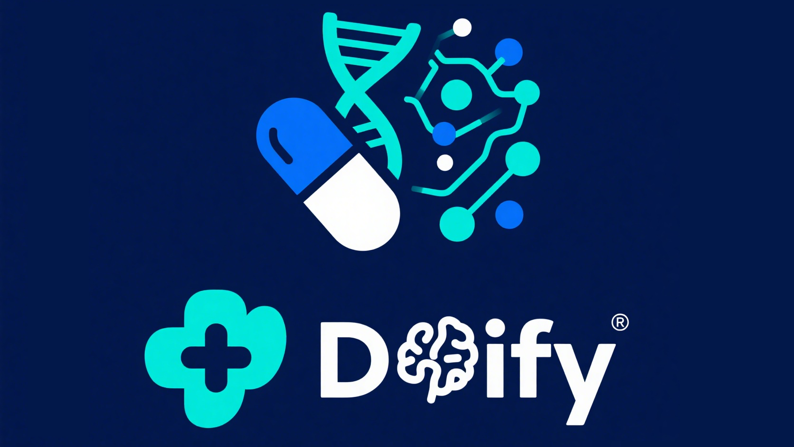

<div align="center">
  
</div>

<div align="center">
  一个基于 Dify 的、面向医药行业的强大 AI 知识库系统。  
  <br>
  本项目集成了文档清洗、智能分段处理和 Web 前端，可实现领域知识库的实时更新与纠错管理。
</div>

<p align="center">
  <br>
  <a href="https://www.python.org/">
    
  </a>
  <a href="https://opensource.org/licenses/MIT">
    
  </a>
  <a href="https://dify.ai/">
    
  </a>
  <a href="https://mineru.ai/">
    
  </a>
</p>


## 快速预览

这里放网址截图

<div align="center">
  
</div>

---

## 目录

- [快速预览](#快速预览)
- [目录](#目录)
- [功能特色](#功能特色)
  - [待办事项](#待办事项)
- [系统原理](#系统原理)
  - [数据处理流程](#数据处理流程)
  - [前端交互机制](#前端交互机制)
- [安装说明](#安装说明)
- [使用方法](#使用方法)
  - [文档导入](#文档导入)
  - [知识库同步](#知识库同步)
  - [前端使用](#前端使用)
- [项目结构](#项目结构)
- [贡献指南](#贡献指南)
- [许可证](#许可证)

---

## 功能特色
- **📄 使用 MinerU 进行文档清洗**：自动清洗原始医药行业文档，为后续智能处理做好准备。
- **🔁 通过 Dify 工作流 API 进行智能分段**：使用 Dify 强大的工作流接口对文档进行父子结构分段。
- **📚 自动同步至知识库**：将清洗与分段后的文档内容自动同步至 Dify 指定知识库。
- **🌐 前端 Web 页面**：直观的网页界面，用户可以：
  - 通过进行AI Chat,查询知识库内容；
  - 纠正 AI 生成的错误答案；；
  - 直接提交新的知识条目。

---

### 待办事项

- ✅ **文档预处理（MinerU 集成）**
  - 已完成使用 MinerU 对原始医药行业文档进行初步清洗，包括去除无关内容、图片格式规范化等。
  - 输出为结构化的清洗文本，便于后续处理。


- ✅ **调用 Dify API 进行父子段落分段处理（Dify API - 分段工作流）**
  - 使用 Python 自动调用 Dify 提供的 Workflow API。
  - 实现调用文档的父子层级分段（chunking）工作流，保留逻辑上下文关系，方便后续知识库同步。


- ⬜️ **知识库自动同步**
  - 功能目标是将处理完成的段落自动提交到对应的知识库（按文档或分类匹配知识库）。
  - 目前数据已可通过脚本上传，但自动归类/增量更新逻辑仍在开发中。
  - 计划增加错误重试、冲突检测、以及上传成功日志追踪。


- ⬜️ **前端 Web 页面开发**
  - 已实现初步版本的前端页面，包括：
    - 知识库搜索与展示
  - 待实现
    - 用户反馈入口（纠错建议）
    - 用户新增知识库内容表单


- ⬜️ **用户反馈处理机制**
  - 支持用户对现有知识内容进行纠错与注释提交。
  - 后台系统计划对用户反馈自动分类，结合审核接口进行判断是否修改知识库内容。


- ⬜️ **新增内容审核与同步机制**
  - 用户新增的知识待进入人工/半自动审核流程。
  - 审核通过后将自动同步进 Dify 知识库，并保留作者记录和修改日志。


- ⬜️ **多文档处理与批量导入支持**
  - 未来将支持上传多个文档进行清洗 + 分段 + 上传的自动化流程。
  - 支持按目录分类管理知识内容。


---

## 系统原理

### 数据处理流程


### 前端交互机制

- 用户可查询知识内容；
- 若发现回答错误，可进行纠正并提交修改建议；
- 可直接新增条目，支持结构化录入；
- 所有操作可追踪并反馈至知识库维护者。

---

## 安装说明

### 克隆仓库

```bash
git clone https://github.com/your-org/pharma-knowledgebase.git
cd pharma-knowledgebase
```

### 安装依赖（建议使用虚拟环境）

```bash
python -m venv venv
source venv/bin/activate  # Windows 使用 venv\Scripts\activate
pip install -r requirements.txt
```

---

## 使用方法

### 文档导入

使用 `doc_preprocess.py` 来执行文档清洗与段落提取：

```bash
python doc_preprocess.py --input data/sample.pdf --output out/cleaned.json
```

### 知识库同步

通过 `dify_uploader.py` 实现自动上传至 Dify 知识库：

```bash
python dify_uploader.py --input out/cleaned.json --kb-id your_kb_id
```

> 可支持选择父子结构上传与分段延迟策略。

### 前端使用

前端采用 Flask + Vue 构建，支持基本交互：

```bash
cd frontend
npm install
npm run dev
```

进入浏览器访问 [http://localhost:5173](http://localhost:5173) 开始使用。

## 项目结构

```
Dify/
├── dify_doc_processor.py   # Dify 文档处理器
├── requirements.txt        # 项目依赖
├── README.md               # 项目说明文档
├── tool_dify.py            # 主程序入口
└── difyConfig.txt          # 配置文件
```

## 贡献指南

欢迎参与贡献！如果你有新功能或改进建议，请随时提交 issue 或 Pull Request。

1. Fork 本仓库
2. 创建你的功能分支（`git checkout -b feature/your-feature-name`）
3. 提交你的更改（`git commit -m '添加了某功能'`）
4. 推送到远程分支（`git push origin feature/your-feature-name`）
5. 提交 Pull Request

## 许可证

本项目基于 MIT 许可证发布，详情请查看 [LICENSE](LICENSE) 文件。